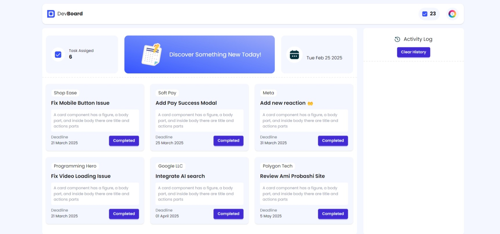

# DevBoard


[Live Website](https://mhmithun.github.io/-Assignment-05-PH/)
[GitHub Repository](https://github.com/MHMITHUN/-Assignment-05-PH)

## 🚀 Overview
DevBoard is a sleek and interactive task management system built using **HTML, Tailwind CSS, DaisyUI, and JavaScript**. It allows users to manage tasks, track activities, and explore helpful developer blogs.

## ✨ Features
- 📌 **Task Management** – Create, complete, and track tasks efficiently.
- 🎨 **Dynamic Themes** – Change background themes with a single click.
- 📝 **Developer Blog Section** – Learn new concepts and explore FAQs.
- 🕒 **Live Date & Activity Log** – Keep track of activities and deadlines.
- 🗑 **Clear History** – Easily reset the activity log.

## 🖼 UI Preview


## 🛠 Tech Stack
- **Frontend**: HTML, Tailwind CSS, DaisyUI, Font Awesome
- **JavaScript Features**: Theme Randomizer, Clear History, Dynamic Task Management

## 🔧 Installation & Setup
1. **Clone the repository:**
   ```bash
   git clone https://github.com/MHMITHUN/-Assignment-05-PH.git
   ```
2. **Navigate to the project folder:**
   ```bash
   cd -Assignment-05-PH
   ```
3. **Open `index.html` in your browser.**
   ```
   Just double-click `index.html` or use a live server extension in VS Code.
   ```

## 📂 Project Structure
```
DevBoard/
├── assets/          # Images, icons, and logos
├── js/              # JavaScript files (theme, activity log, etc.)
├── blog.html        # Blog page for developer insights
├── index.html       # Main dashboard
├── README.md        # Project documentation
└── style.css        # (Optional: If additional styling is needed)
```

## 🎯 Usage
- **Managing Tasks:** Click on tasks to mark them as completed.
- **Random Theme Generator:** Click on the theme button to get a fresh background color.
- **Clearing History:** Use the "Clear History" button to reset the activity log.

## 🎉 Contributing
Contributions are welcome! If you find a bug or have suggestions, feel free to create an issue or submit a pull request.

## 📜 License
This project is licensed under the **MIT License**. Feel free to use and modify it as needed.

## 📬 Contact
For questions or collaborations, reach out via [your-email@example.com](mailto:mhmmithun1@gmail.com).

---
🚀 _Built with passion for better task management and productivity._


---

---
